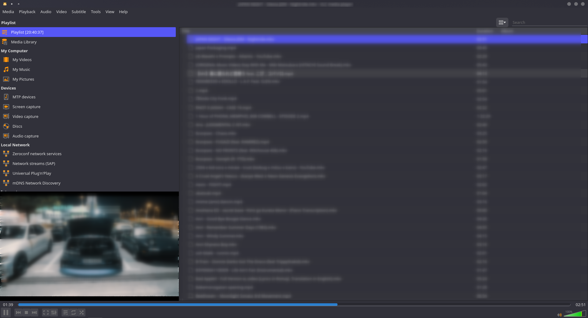

# How to listen to and manage your music.
 Simple guide to manage your music more efficiently.

## Spotify users
For streaming spotify, I use spotifyd + spotify-tui, which does require spotify premium
If you prefer using the normal spotify app, it is available on the AUR
`yay -S spotify`
 or if you want to use spotifyd and spotify-tui
 ```sh
 yay -S spotifyd
 yay -S spotify-tui
 ```
 First configure spotifyd. You will need to create the directories and also the the conf file at `~/.config/spotifyd/spotifyd.conf`
 ```sh
 sudo micro ~/.config/spotifyd/spotifyd.conf
 ```
 and use this config template.
```sh
[global]
# Your Spotify account name.
username = "username"

# Your Spotify account password.
password = "password"

# A command that gets executed and can be used to
# retrieve your password.
# The command should return the password on stdout.
#
# This is an alternative to the `password` field. Both
# can't be used simultaneously.
password_cmd = "command_that_writes_password_to_stdout"

# If set to true, `spotifyd` tries to look up your
# password in the system's password storage.
#
# This is an alternative to the `password` field. Both
# can't be used simultaneously.
use_keyring = true

# If set to true, `spotifyd` tries to bind to the session dbus
# and expose MPRIS controls. When running headless, without a dbus session,
# then set this to false to avoid binding errors
use_mpris = true

# The audio backend used to play music. To get
# a list of possible backends, run `spotifyd --help`.
backend = "alsa" # use portaudio for macOS [homebrew]

# The alsa audio device to stream audio. To get a
# list of valid devices, run `aplay -L`,
device = "alsa_audio_device"  # omit for macOS

# The alsa control device. By default this is the same
# name as the `device` field.
control = "alsa_audio_device"  # omit for macOS

# The alsa mixer used by `spotifyd`.
mixer = "PCM"  # omit for macOS

# The volume controller. Each one behaves different to
# volume increases. For possible values, run
# `spotifyd --help`.
volume_controller = "alsa"  # use softvol for macOS

# A command that gets executed in your shell after each song changes.
on_song_change_hook = "command_to_run_on_playback_events"

# The name that gets displayed under the connect tab on
# official clients. Spaces are not allowed!
device_name = "device_name_in_spotify_connect"

# The audio bitrate. 96, 160 or 320 kbit/s
bitrate = 160

# The directory used to cache audio data. This setting can save
# a lot of bandwidth when activated, as it will avoid re-downloading
# audio files when replaying them.
#
# Note: The file path does not get expanded. Environment variables and
# shell placeholders like $HOME or ~ don't work!
cache_path = "cache_directory"

# If set to true, audio data does NOT get cached.
no_audio_cache = true

# Volume on startup between 0 and 100
# NOTE: This variable's type will change in v0.4, to a number (instead of string)
initial_volume = "90"

# If set to true, enables volume normalisation between songs.
volume_normalisation = true

# The normalisation pregain that is applied for each song.
normalisation_pregain = -10

# After the music playback has ended, start playing similar songs based on the previous tracks.
autoplay = true

# The port `spotifyd` uses to announce its service over the network.
zeroconf_port = 1234

# The proxy `spotifyd` will use to connect to spotify.
proxy = "http://proxy.example.org:8080"

# The displayed device type in Spotify clients.
# Can be unknown, computer, tablet, smartphone, speaker, t_v,
# a_v_r (Audio/Video Receiver), s_t_b (Set-Top Box), and audio_dongle.
device_type = "speaker"
```

  For more information visit the [spotifyd repository](https://github.com/Spotifyd/spotifyd), and their documentation [here](https://github.com/Spotifyd/spotifyd/tree/master/docs/src).

## Music videos

I like storing some music as their music videos found on sites such as YouTube. I just use vlc play my playlists. You can also hide the vlc window to the toolbar as an icon which is also useful.

How the VLC playlist view looks:


